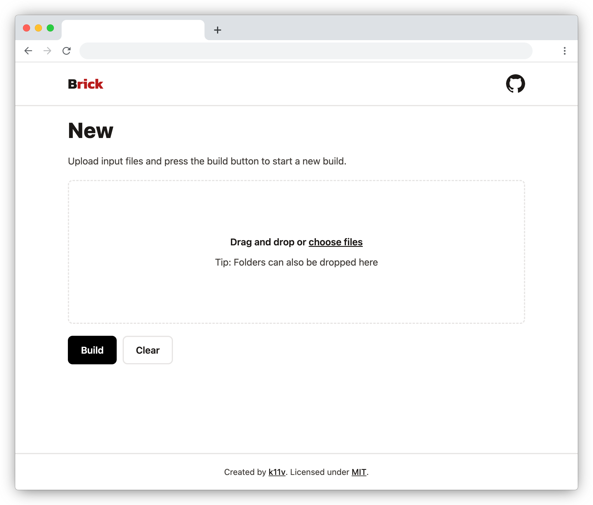
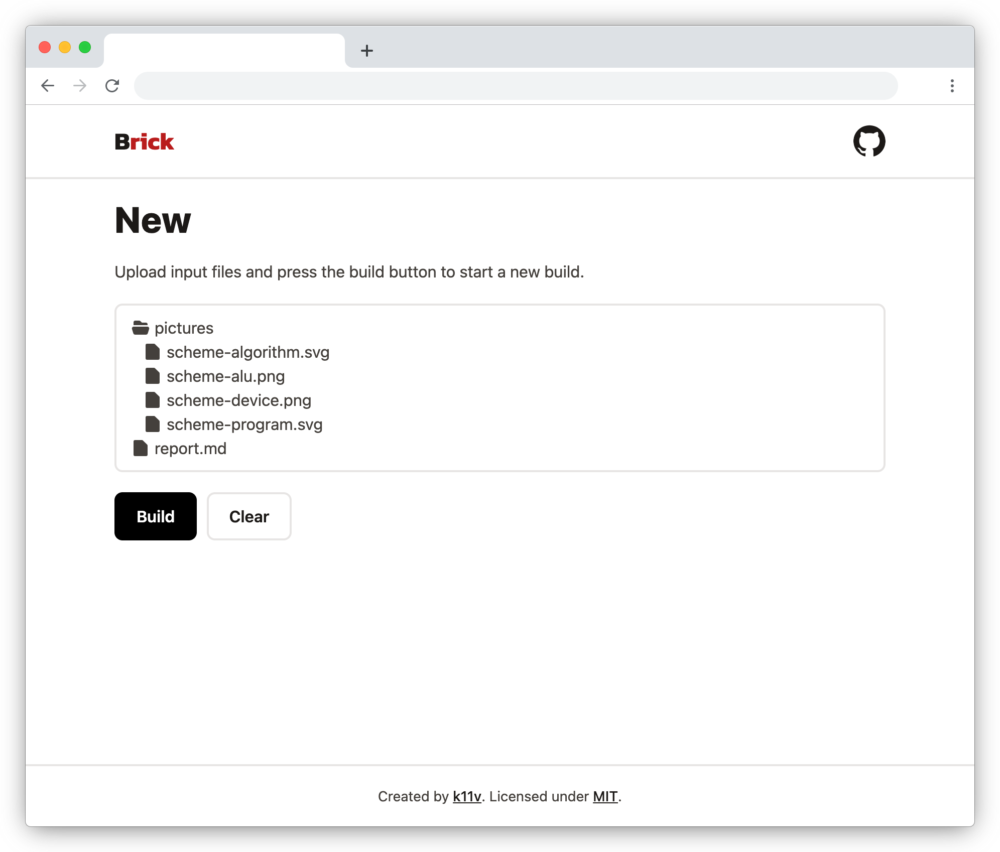

# Brick

Brick is a service that builds PDF files from Markdown files.

## Status

The service is functionally complete but some unhappy paths are not fully implemented yet.
Also the presentation layer is being rewritten as of March 2025.
Here are some screenshots from [0de7c30](https://github.com/k11v/brick/tree/0de7c304f612b6db2b670478ac7becb07934a55b).

